<div align="center">


<h1>Zeroth</h1>

<p><b>One engineering standard your AI coding agents actually follow.</b><br>
On every project, in any language.</p>

<p>
  
  
  
  
</p>



<p>
  <a href="https://douglasvulcano.github.io/zeroth-ai/"><b>Website</b></a>
  &nbsp;&#183;&nbsp; <b>English</b>
  &nbsp;&#183;&nbsp; <a href="README.pt-BR.md">Português</a>
</p>

</div>

---

## 🧭 What it is

AI agents write code a little differently every time. Zeroth gives them one shared playbook, so the
way you work, build, test, and ship stays the same no matter which agent or model is helping. It is
three things:

- **A standard** you install once and reuse everywhere (the full, readable spec is [`zeroth.md`](zeroth.md)).
- **A skill** that loads the right part automatically when you start, plan, or review work.
- **A scaffolder** that drops governance into any repo in one command (issue/PR templates, a CI gate,
  `AGENTS.md`, safety rules).

> [!TIP]
> You do not adopt it all at once. Install it and the agent starts applying the standard right away;
> run the scaffolder later, when you want a repo to actually enforce it.

## 🚀 Install

**For a team (recommended)** - versioned, no drift. In Claude Code:

```text
/plugin marketplace add DouglasVulcano/zeroth-ai
/plugin install zeroth
```

**For yourself** - a global skill on your machine:

```bash
git clone https://github.com/DouglasVulcano/zeroth-ai.git
cd zeroth-ai
bash install-skill.sh
```

Update later with `claude plugin update` (plugin) or `git pull && bash install-skill.sh` (skill).

## 🤝 Using another agent? You are covered too

Zeroth's home is **Claude Code**, where it installs as a plugin and triggers on its own. But the
standard itself is **model-agnostic**: it lives in a plain [`AGENTS.md`](https://agents.md) file, the
open format that Cursor, GitHub Copilot, OpenAI Codex, Windsurf, Gemini CLI, Aider and others already
read. Point Zeroth at your repo once, and every agent on your team follows the same playbook - no
plugin required.

| Your agent | How it picks up Zeroth |
|---|---|
| **Claude Code** | Plugin/skill (automatic), or `AGENTS.md` |
| **Cursor, Copilot, Codex, Windsurf, Gemini CLI, Aider, ...** | Reads the `AGENTS.md` the scaffolder writes |

```bash
# Not on Claude Code? Clone, then let the scaffolder write AGENTS.md into your repo:
git clone https://github.com/DouglasVulcano/zeroth-ai.git
bash zeroth-ai/skills/zeroth/scaffold.sh /path/to/your/repo
```

<details>
<summary><b>Or paste the bootstrap block into your <code>AGENTS.md</code> by hand</b></summary>

```markdown
## Zeroth (project standard)
1. Workflow: Issue-first, PR-driven. Every task is an Issue; every deploy is a PR that closes it
   (`Closes #N`). Conventional Commits.
2. Motion and UI: every screen has skeleton, lazy loading, and smooth enter/exit/loading states;
   honor `prefers-reduced-motion`; animate only `transform`/`opacity`.
3. Quality and Testing: the `fmt -> lint -> typecheck -> arch -> deadcode -> test -> coverage -> build`
   CI gate; bind each verb to the stack. Enforcement is CI plus branch protection; the skill is advice.
4. Observability (opt-in, deployed apps): instrument with OpenTelemetry (or your existing stack) only
   when you ship a service with real traffic.
Full spec: https://github.com/DouglasVulcano/zeroth-ai/blob/main/zeroth.md
```

</details>

## ⌨️ Use

- **Automatic** - just work. The skill triggers when your request matches ("create the issue and PR",
  "review this screen", "set up the CI gate", "follow the standards").
- **On demand** - run `/zeroth` to apply everything, or focus one area:

  ```text
  /zeroth workflow | ui | testing | o11y | arsenal | scaffold | review
  ```

- **Review before you ship** - `/zeroth-review` audits your current diff against the 4 pillars and
  reports findings; it is read-only and never edits. Or just ask: "review my changes against the
  standard".
- **Set up a repo** - `/zeroth scaffold` (or preview first with
  `bash skills/zeroth/scaffold.sh /path/to/repo --dry-run`) adds issue/PR templates, a stack-aware CI
  gate, `AGENTS.md`, and safety rules. It detects your stack, never overwrites without `--force`, and
  is safe to re-run. Add `--with-plugin DouglasVulcano/zeroth-ai` to auto-enable the plugin for
  everyone who trusts the repo.

> Once installed, Zeroth also works quietly in the background: safety guards on clearly destructive
> commands, plus non-blocking nudges (a Pillar 2 motion check on UI edits, and a one-time scaffold
> reminder in repos that do not carry the standard yet). Nothing blocks your work.

## 🏛️ What you get: the 4 pillars

| # | Pillar | In one line |
|:-:|---|---|
| **1** | 🔁 **Workflow** | Issue-first, PR-driven. Every task is an Issue; every deploy is a PR that closes it (`Closes #N`). Conventional Commits. |
| **2** | 🎬 **Motion and UI** | Every screen has skeleton, lazy loading, and smooth enter/exit/loading states; respects `prefers-reduced-motion`. |
| **3** | ✅ **Quality and Testing** | One CI gate (`fmt -> lint -> typecheck -> arch -> deadcode -> test -> coverage -> build`), bound to your stack. Observability (OpenTelemetry) is opt-in, for deployed apps. |
| **4** | 🧰 **Arsenal** | The right MCP or skill per task: UI generation, browser performance, motion, humanized copy. |

The standard is **stack-agnostic**: the gate is a set of contracts, and each verb maps to your
language's tools (JS/TS, Python, Go, Rust, JVM, .NET). The skill is advice; your **CI plus branch
protection** are what actually enforce it.

## 📚 Learn more

- **[Full specification (`zeroth.md`)](zeroth.md)** - the complete standard, readable end to end.
- **[Security](SECURITY.md)** - threat model, branch protection, and the trust boundary.
- **[Contributing](CONTRIBUTING.md)** - how to change the standard and pass the gate.
- **[Research and benchmarks](docs/research-and-benchmarks.md)** - the evidence behind the design.

<details>
<summary><b>Per-domain deep dives</b> (the skill loads these on demand)</summary>

- [Workflow and governance](skills/zeroth/references/workflow-github.md)
- [Motion and UI](skills/zeroth/references/motion-and-ui.md)
- [Quality and testing (the CI gate)](skills/zeroth/references/quality-and-testing.md)
- [Observability (deployed apps, opt-in)](skills/zeroth/references/observability.md)
- [Per-stack commands](skills/zeroth/references/stack-appendix.md)
- [Arsenal (MCP servers and skills)](skills/zeroth/references/arsenal-mcp-skills.md)

</details>

## 📄 License

MIT. Standards distilled from the author's configuration and the projects in the Arsenal.
